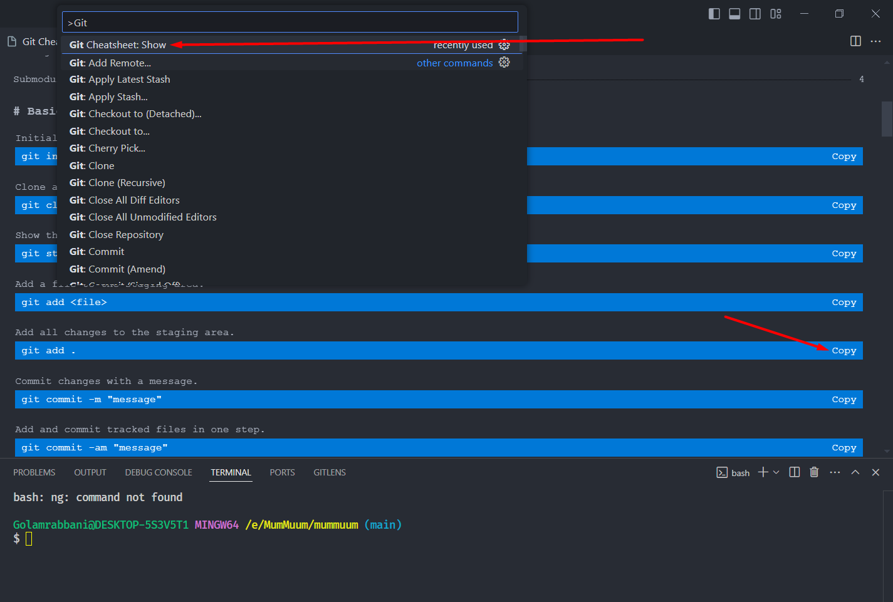

# Git Cheatsheet

Here's a comprehensive Git command cheat sheet for commonly used Git operations
VS Code extension that lets you open a Git cheatsheet directly in the editor.

## Features

To open the cheatsheet press Ctrl+Shift+P (Win, Linux) / Cmd+Shift+P (Mac) and search for the Open Git Cheatsheet show command.

You can also copy each command by clicking on the “Copy” button on the right.

The colors on the cheatsheet page automatically adapt to the selected theme. The font is based on the user’s preferred font family.

## Demo

Using the Open Git Cheatsheet command

